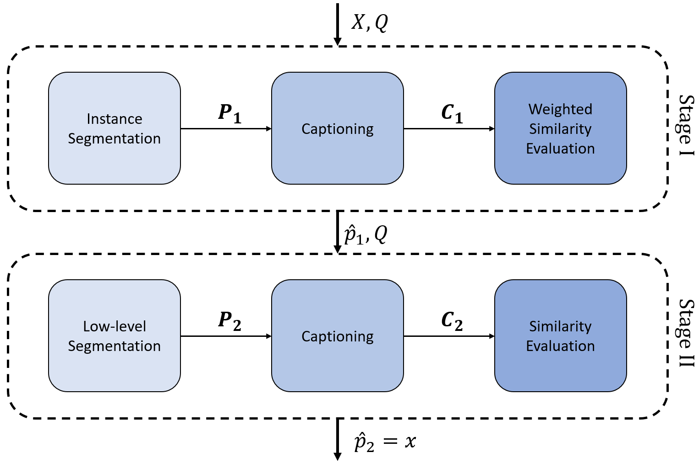
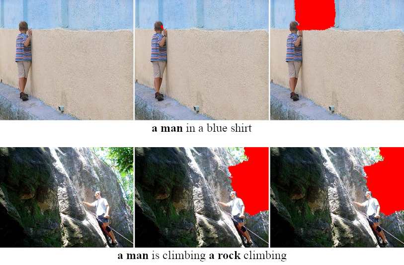

# PIC-XAI
PIC-XAI: Post-hoc Image Captioning Explanation using Segmentation. <br>
Paper link: *not yet*

## Acknowledgement
The code uses two instance segementation models from Facebook [Detectron2](https://https://github.com/facebookresearch/detectron2).

## Introduction
Several XAI techniques were proposed to boost DL-based models' understandability, but there is a lack of focus on image captioning application. The main challenge in explaining the IC model prediction, i.e. generated caption, is its complex nature. Ideally, the prediction is expected to contain the elements, i.e. things and stuff, in the input image and reflect the interaction between them. Additionally, it should describe the elements visual features; e.g. colors, lighting conditions and weather. Thus, this information should be reflected in the explanation accurately.
We propose an algorithmic approach to explain black-box IC models prediction, i.e. generated caption. To understand why a certain word(s), i.e. query, appears in the generated caption, our method relies mainly on segmentation components to generate explanation proposal(s), i.e. answer. Later, it measures the proposal(s) relevance based on their IC model prediction. Furthermore, considering that XAI methods for IC task are only evaluated qualitatively so far, hence, we provide the first quantitative measure in this domain aiming for a more objective assessment.

## Description
### PIC-XAI
Given an image and the corresponding IC model generated caption, our method explains the query by a patch of pixels. For instance, if the IC model has generated the following caption for an image: "A man is swimming in the water", the algorithm tries to answer why the query "man" appears in the caption by highlighting the corresponding region (pixels) in the image.
In order to generate the answer, our algorithm nominates proposal(s) and evaluates them on two stages. Each stage has three steps: generate proposals, evaluate them and making the decision accordingly.
<br><br><br>
### XIC
We claim that the answe is adequate if it corresponds to the query given the IC model. In other words, it is good if it possesses enough information for the IC model to generate the query. In practice, to test the answer we generate a set of test images at first. Each contains~ the answer with different backgrounds. We suggest three (*K=3*) "neutral" options (*this can be fine-tuned w.r.t the user need*): black, white and random. Then, we pass each test image to the IC model and check the presence of the query in the generated corresponding predictions. If the query appears in any of the test captions, we assume that the answer is adequate. As a result, **XIC** provides a binary local evaluation for the answer that was generated by the XAI method. It states that either the XAI answer for the query is successful **1** or not **0**.

<br><br><br>

where

<br><br><br>
<br><br><br>


## Qualitative results
We tested our algorithm **PIC-XAI** and metric **XIC** on test queries and the corrosponding images. We show two set of results (*good and bad*).
#### Good results
<br><br><br>
#### Bad results
<br><br><br>

## Usage
In this repo we use a segmentation model that was trained on Lvis and MSCOCO data sets. For low-level segmentation quickshift, felzenszwalb or slic can be used. We use an IC models that were traiend on Flickr8k and MSCOCO data sets. All those techniques can be fine-tuned w.r.t the user need.
To use *PIC-XAI*, set the proper parameters and paths and run the following command:
'''
python .\PIC-XAI\IterIC.py
'''

Please refer to this repository and cite our publication when using this work.

## Cite
```
not yet
```

## License
Other work and this work licences are included in <a href="./Licenses/">Licenses</a> folder. <br>
This work license is: <a href="./Licenses/LICENSE">GNU Affero General Public License v3.0</a>.