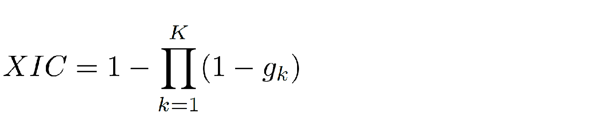
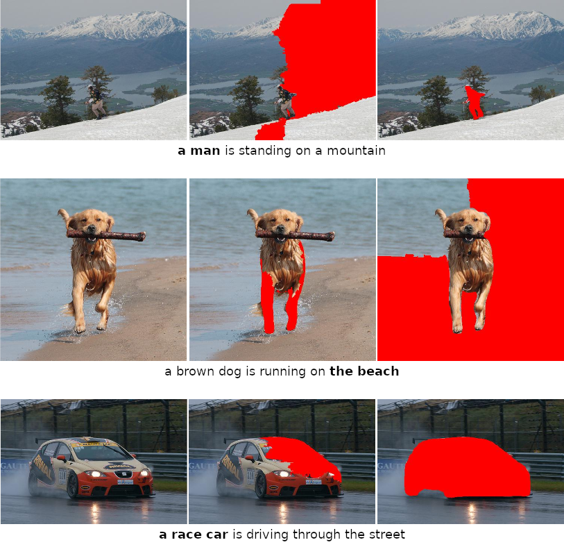

# PIC-XAI
[PIC-XAI: Post-hoc Image Captioning Explanation using Segmentation](https://doi.org/10.1109/SACI58269.2023.10158563) <br>
iPIC-XAI: Improving PIC-XAI for Enhanced Image Captioning Explanation *(Paper link is not available yet)*. <br>

## Acknowledgement
The code uses two instance segementation models from Facebook [Detectron2](https://https://github.com/facebookresearch/detectron2).

## Introduction
Several XAI techniques were proposed to boost DL-based models' understandability, but there is a lack of focus on image captioning application. The main challenge in explaining the IC model prediction, i.e. generated caption, is its complex nature. Ideally, the prediction is expected to contain the elements, i.e. things and stuff, in the input image and reflect the interaction between them. Additionally, it should describe the elements visual features; e.g. colors, lighting conditions and weather. Thus, this information should be reflected in the explanation accurately.
We propose an algorithmic approach to explain black-box IC models prediction, i.e. generated caption. To understand why a certain word(s), i.e. query, appears in the generated caption, our method relies mainly on segmentation components to generate explanation proposal(s), i.e. answer. Later, it measures the proposal(s) relevance based on their IC model prediction. Furthermore, considering that XAI methods for IC task are only evaluated qualitatively so far, hence, we provide the first quantitative measure in this domain aiming for a more objective assessment.

## Description
### PIC-XAI and iPIC-XAI
Given an image and the corresponding IC model generated caption, our method explains the query by a patch of pixels. For instance, if the IC model has generated the following caption for an image: "A man is swimming in the water", the algorithm tries to answer why the query "man" appears in the caption by highlighting the corresponding region (pixels) in the image.
*iPIC-XAI* is an improved version of *PIC-XAI*. The improvement relies on various components; (1) utilizing CLIP in the first stage for more efficient execution with multimodal similarity, (2) considering the query dependency tag as a clue for larger elements in the scene to provide more chance for bigger answers to be proposed, (3) setting the blurring kernel size automatically for more convenience, and (4) proposing the most relevant answer from the two algorithm's stages.

<br><br><br><br>
<br><br><br><br>
### iXIC

<br><br><br>

### iXIC and XIC 
We claim that the answe is adequate if it corresponds to the query given the IC model. In other words, it is good if it possesses enough information for the IC model to generate the query. In practice, we do this evaluation in two approaches: **XIC** and **iXIC**. <br>
In **XIC**, to test the answer we generate a set of test images at first. Each contains the answer with different backgrounds. We suggest three (*K=3*) "neutral" options (*this can be fine-tuned w.r.t the user need*): black, white and random. Then, we pass each test image to the IC model and check the presence of the query in the generated corresponding predictions. If the query appears in any of the test captions, we assume that the answer is adequate. As a result, **XIC** provides a binary local evaluation for the answer that was generated by the XAI method. It states that either the XAI answer for the query is successful **1** or not **0**.
<br><br><br>
where
<br><br>
<br><br>

However, **XIC** has some drawbacks, for instance, it requires specifying *K* backgrounds to form the set of test images. In some cases, it might fail to provide reliable evaluation. For example, if the selected background and the query share a common feature; white background and "snow" or black background and "dark". We overcome this in **iXIC** by replacing the images set by one test image. We generate the test image by blurring the original image around the given answer region. We consider the answer as correct if the CLIP similarity with the query is larger for the test image than the original image.
<br><br><br>

The following figure shows **iXIC** (in green) better alignment with the human evaluator (in blue) compared to **XIC** (in red) for all the experiments variations.
<br><br><br>

## Qualitative results
Correctly answered examples from the test set. The original image is in the first column. The second and third columns are the answers from *PIC-XAI* and *iPIC-XAI*, respectively. The answer is masked with red, and the query is highlighted in bold.

<br><br><br>

## Usage
In this repo we use two segmentation models, they were trained on Lvis and MSCOCO data sets. For low-level segmentation quickshift, felzenszwalb or slic can be used. We use IC models that were traiend on Flickr8k and MSCOCO data sets. All those techniques can be fine-tuned w.r.t the user need.
To use our algorithm(s), set the proper parameters and paths and run the following command:
```
python .\PIC-XAI\IterIC.py
```

The module contain many flags to set, however, the following flags set the main algorithm parameters:
<ol><i>
  <li>clip_mode: "0", "1", "2" and "both" for not using CLIP, using it in stageI, in stageII and in both stages, respectively.</li>
  <li>pobj_mode: applying object of preposition rule (True) or not (False).</li>
  <li>stage_hi_sim: using stage result with higher similarity (True) or not (False).</li>
  <li>blur_ksize: setting blurring kernel size manually or automatically ("auto").</li>
  <li>improved_XIC: using improved XIC (True) or not (False).</li>
</i></ol>

for instance, the following command runs *PIC-XAI* algorithm (CLIP and Object of preporition rule are not used, stageI proposal is always considered as an answer, and the blurring kernel size is 20).
```
python .\PIC-XAI\IterIC.py -clip_mode 0 -pobj_mode False -stage_hi_sim False -blur_ksize 20
```

Please refer to this repository and cite our publication when using this work.

## Cite
```
@inproceedings{al2023pic,
  title={PIC-XAI: Post-hoc Image Captioning Explanation using Segmentation},
  author={Al-Shouha, Modafar and Sz{\H{u}}cs, G{\'a}bor},
  booktitle={2023 IEEE 17th International Symposium on Applied Computational Intelligence and Informatics (SACI)},
  pages={000033--000038},
  year={2023},
  organization={IEEE},
  doi={10.1109/SACI58269.2023.10158563}
}

@iPIC-XAI BibTeX citation is not available yet.
```

## License
Other work and this work licences are included in <a href="./Licenses/">Licenses</a> folder. <br>
This work license is: <a href="./Licenses/LICENSE">GNU Affero General Public License v3.0</a>.
